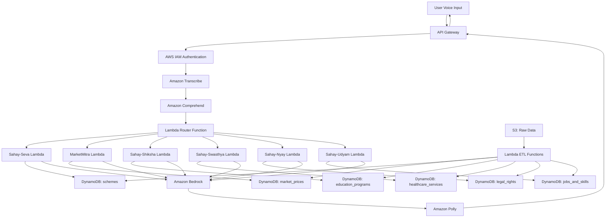

# Design Document: AI-Sahayak Voice Assistant

## Overview

AI-Sahayak is a serverless, voice-first multilingual AI assistant built on AWS that helps Indian citizens access government services, welfare schemes, markets, education, healthcare, legal rights, and employment opportunities. The system processes voice input in Hindi and English, provides eligibility-based results, and responds with simplified voice output suitable for low-literacy users.

The architecture follows a microservices pattern using AWS Lambda functions orchestrated through API Gateway, with Amazon Transcribe for speech-to-text, Amazon Comprehend for language detection and intent classification, Amazon Bedrock for response generation, Amazon Polly for text-to-speech, and DynamoDB for structured data storage.

## Architecture

### High-Level Architecture



### Service Architecture Layers

1. **Presentation Layer**: API Gateway with IAM authentication
2. **Voice Processing Layer**: Amazon Transcribe and Amazon Polly
3. **Intelligence Layer**: Amazon Comprehend and Amazon Bedrock
4. **Business Logic Layer**: Lambda functions for each service module
5. **Data Layer**: DynamoDB tables and S3 storage
6. **Security Layer**: AWS IAM for authentication and authorization

## Components and Interfaces

### Voice Processing Components

#### Amazon Transcribe Integration
- **Purpose**: Convert Hindi and English speech to text
- **Configuration**: Real-time streaming API with language identification
- **Input**: Audio stream (WebRTC, MP3, WAV formats)
- **Output**: Transcribed text with confidence scores
- **Error Handling**: Retry mechanism for low-confidence transcriptions

#### Amazon Polly Integration
- **Purpose**: Convert response text to natural speech
- **Configuration**: Neural voices for Hindi (Aditi) and English (Joanna)
- **Input**: Simplified text responses from Bedrock
- **Output**: Audio stream in MP3 format
- **Features**: SSML support for pronunciation and pacing

### Language and Intent Processing

#### Amazon Comprehend Integration
- **Language Detection**: Automatic identification of Hindi vs English
- **Custom Classification**: Trained model for six intent categories
  - GOVT_SCHEME
  - MARKET_PRICE
  - EDUCATION
  - HEALTHCARE
  - LEGAL
  - JOBS
- **Confidence Threshold**: 80% minimum for intent classification
- **Fallback**: Clarification prompts for ambiguous inputs

#### Intent Router Lambda Function
```python
# Pseudo-interface
def route_intent(text: str, language: str, confidence: float) -> str:
    if confidence < 0.8:
        return generate_clarification_prompt(text, language)
    
    intent = classify_intent(text)
    return invoke_service_lambda(intent, text, language)
```

### Service Module Components

#### Sahay-Seva (Government Schemes) Lambda
- **Eligibility Engine**: Filters schemes by age, income, category, location
- **Data Source**: DynamoDB schemes table
- **Response Format**: Scheme details, benefits, required documents, application steps

#### MarketMitra (Agricultural Markets) Lambda
- **Price Comparison**: Current market price vs MSP analysis
- **Location Services**: Nearest mandi identification
- **Data Source**: DynamoDB market_prices table with daily updates
- **Response Format**: Price data, trends, recommendations

#### Sahay-Shiksha (Education) Lambda
- **Program Matching**: Educational programs based on background and goals
- **Eligibility Checking**: Scholarship and skill program qualification
- **Data Source**: DynamoDB education_programs table
- **Response Format**: Program details, eligibility, application process

#### Sahay-Swasthya (Healthcare) Lambda
- **Service Locator**: Nearest government hospitals and clinics
- **Scheme Checker**: Ayushman Bharat and other health scheme eligibility
- **Data Source**: DynamoDB healthcare_services table
- **Response Format**: Facility information, scheme details, contact information

#### Sahay-Nyay (Legal Rights) Lambda
- **Rights Information**: Relevant laws and citizen protections
- **Legal Aid Locator**: Nearby legal aid centers and services
- **Data Source**: DynamoDB legal_rights table
- **Response Format**: Rights explanation, next steps, contact information

#### Sahay-Udyam (Employment) Lambda
- **Job Matching**: Skill-based job recommendations
- **Scheme Information**: MSME, Startup India, self-employment programs
- **Data Source**: DynamoDB jobs_and_skills table
- **Response Format**: Job opportunities, scheme details, application guidance

### Response Generation

#### Amazon Bedrock Integration
- **Model**: Anthropic Claude for text simplification and humanization
- **Prompt Templates**: Predefined templates for each service module
- **Language Support**: Hindi and English response generation
- **Safety Filters**: Built-in content filtering and disclaimer injection

```python
# Pseudo-prompt template
SIMPLIFICATION_PROMPT = """
Convert this government data into simple, easy-to-understand language for a citizen with limited literacy:

Data: {structured_data}
Language: {target_language}
Context: {service_context}

Requirements:
- Use simple words and short sentences
- Include step-by-step instructions
- Add appropriate disclaimers
- Maintain accuracy while simplifying
"""
```

## Data Models

### DynamoDB Table Schemas

#### schemes Table
```json
{
  "scheme_id": "string (Primary Key)",
  "scheme_name": "string",
  "category": "string", // scholarship, farmer, women, pension, disability, msme
  "min_age": "number",
  "max_age": "number", 
  "income_limit": "number",
  "benefits": "string",
  "documents_required": "list",
  "application_process": "list",
  "contact_info": "string",
  "created_date": "string",
  "updated_date": "string"
}
```

#### market_prices Table
```json
{
  "price_id": "string (Primary Key)",
  "crop": "string",
  "mandi": "string",
  "district": "string",
  "state": "string",
  "price": "number",
  "msp": "number",
  "date": "string (Sort Key)",
  "unit": "string",
  "quality": "string"
}
```

#### education_programs Table
```json
{
  "program_id": "string (Primary Key)",
  "program_name": "string",
  "category": "string", // scholarship, skill, vocational
  "eligibility": "map",
  "duration": "string",
  "organization": "string",
  "benefits": "string",
  "application_deadline": "string",
  "contact_info": "string"
}
```

#### healthcare_services Table
```json
{
  "service_id": "string (Primary Key)",
  "hospital_name": "string",
  "scheme": "string",
  "location": "map", // district, state, pincode
  "contact": "string",
  "services_offered": "list",
  "eligibility_criteria": "map",
  "timings": "string"
}
```

#### legal_rights Table
```json
{
  "right_id": "string (Primary Key)",
  "issue_type": "string", // labour, tenant, women, consumer
  "law": "string",
  "citizen_right": "string",
  "next_step": "list",
  "legal_aid_centers": "list",
  "contact_info": "string"
}
```

#### jobs_and_skills Table
```json
{
  "job_id": "string (Primary Key)",
  "skill": "string",
  "job_role": "string",
  "salary_range": "map",
  "scheme": "string", // skill_india, startup_india, msme
  "eligibility": "map",
  "training_duration": "string",
  "certification": "string",
  "contact_info": "string"
}
```

### Data Access Patterns

#### Query Patterns by Service
1. **Schemes**: Query by category + filter by eligibility criteria
2. **Market Prices**: Query by crop + sort by date + filter by location
3. **Education**: Query by category + filter by eligibility
4. **Healthcare**: Query by location + filter by scheme
5. **Legal Rights**: Query by issue_type
6. **Jobs**: Query by skill + filter by eligibility

#### Global Secondary Indexes (GSI)
- **schemes-category-index**: category (PK), min_age (SK)
- **market-crop-date-index**: crop (PK), date (SK)
- **education-category-index**: category (PK), application_deadline (SK)
- **healthcare-location-index**: district (PK), scheme (SK)
- **legal-issue-index**: issue_type (PK)
- **jobs-skill-index**: skill (PK), salary_range (SK)

## Error Handling

### Voice Processing Errors
- **Transcription Failures**: Retry with noise reduction, fallback to text input option
- **Language Detection Errors**: Default to Hindi, allow manual language selection
- **Audio Quality Issues**: Request user to speak more clearly or move to quieter location

### Intent Classification Errors
- **Low Confidence**: Present menu of available services for user selection
- **Multiple Intents**: Ask clarifying questions to determine primary intent
- **Unknown Intent**: Provide overview of available services and examples

### Data Retrieval Errors
- **No Results Found**: Suggest alternative search criteria or related services
- **Database Timeouts**: Implement exponential backoff retry mechanism
- **Partial Data**: Return available information with disclaimer about incomplete data

### Response Generation Errors
- **Bedrock API Failures**: Fallback to template-based responses
- **Text-to-Speech Errors**: Provide text-based response as backup
- **Language Translation Issues**: Default to English with apology message

### Safety and Disclaimer Handling
- **Medical Information**: Always include "This is informational only, consult healthcare professionals"
- **Legal Advice**: Always include "This is general information, consult legal professionals"
- **Financial Schemes**: Always include "Verify eligibility and details with official sources"
- **Emergency Situations**: Immediately provide emergency contact numbers

## Testing Strategy

### Unit Testing Approach
The system will use a dual testing approach combining unit tests for specific scenarios and property-based tests for comprehensive validation.

**Unit Test Focus Areas:**
- API endpoint validation with specific request/response examples
- Database query accuracy with known test data
- Error handling scenarios with simulated failures
- Integration points between AWS services
- Edge cases like empty responses or malformed data

**Property-Based Test Configuration:**
- Use Hypothesis (Python) for property-based testing
- Minimum 100 iterations per property test
- Each test tagged with format: **Feature: ai-sahayak, Property {number}: {property_text}**
- Tests will validate universal properties across all possible inputs
- Focus on data consistency, response format validation, and business rule compliance

**Testing Infrastructure:**
- AWS Lambda test harness for serverless function testing
- DynamoDB Local for database testing
- Mock AWS services for integration testing
- Automated test execution in CI/CD pipeline
- Performance testing for voice processing latency